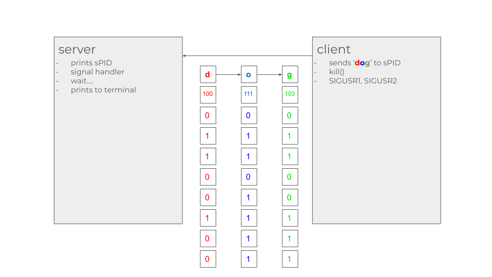
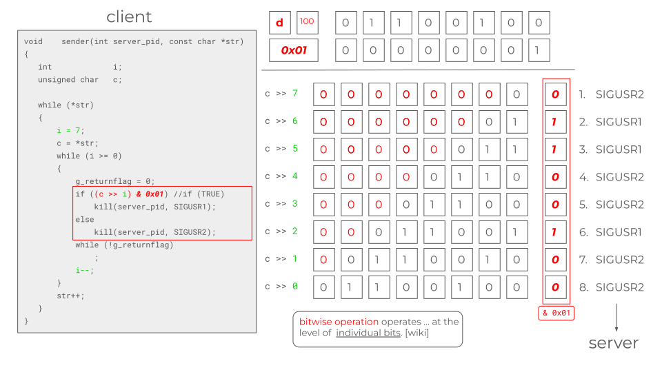
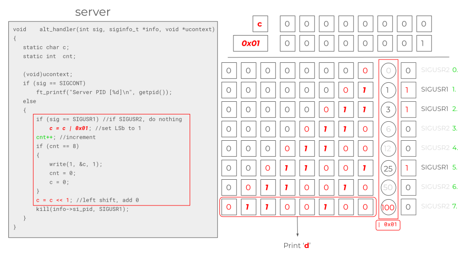

# Minitalk

## Content
1. server_bonus
>	1. int	main(void)
>	2. void	alt_handler(int sig, siginfo_t *info, void *ucontext)
2. client_bonus
>	1. int	main(int argc, char *argv[])
>	2. void	alt_handler(int sig, siginfo_t *info, void *ucontext)
>	3. void	sender(int server_pid, const char *str)
3. minitalk.h
>	1. include libft & friends
>	2. include signal.h

## Flow
- Following reccommendation in the internet, use `sigaction()` instead of `signal()`.
- Can only use `kill()` to send signals hence the use of alternate signal handler in sigaction because `SA_SIGINFO` can then contain `si_pid`. This is useful in the design of how the two programs communicate with each other
- The server starts first, printing the PID of it's process by `getpid()`. 
- The server handles user signals (<kbd>SIGUSR1</kbd>/<kbd>SIGUSR2</kbd>) by `sigaction()`. Instead of using `sa.handler` that takes only one <kbd>int</kbd> argument, an alternative handler (`alt_handler()`) is used instead. For this, the flag SA_SIGINFO has to be declared. This flag enables the access of the info struct that can contain the PID of the signal sender. It is advantageous because **after** the server receives a signal sent from the client, it can then ping the client back giving confirmation that it has indeed received the signal, and allow the client to `kill()` (send) the next signal. 
- To avoid valgrind leaks, the sa.flags is initialized by `sigemptyset()`. other method of initializing may work just as well.
- The client side start with some control sequences for invalid inputs. The `sigaction()` on the client uses an alternative handler (another `alt_handler()`) as well, though there is **no** advantage of this, `sa.handler` would work just as well. The client side only handles incoming signal from the server that pings a confirmation back, "switching" a global flag on (<kbd>g_returnflag</kbd>) to signify the signal receipt on the server. 
- Sending string from the input argument is done by the function `sender()`. This function traverses the string for each of the characters, then decomposes the character into its bits (8 bits) in a countdown loop (from i = 7, down to 0). It first checks if the global flag is turned off. If it is, then the function performs a bitwise AND operation comparing the bits of the character with 0x01 (0000 0001). Whatever the result of the evaluation, it would determine which signal to send (<kbd>SIGUSR1</kbd> for 1, <kbd>SIGUSR2</kbd> for 0). To send the first bit of the character (1st bit) as the first signal, a bitwise right shift operation has to be performed first. This is explained in a more illustrative way in the slides. Then the server waits for a signal ping from the server that would "flip" the global flag to 1 (handled by the `alt_handler()`), then Afterwards, to send the second bit as the second signal, another bitwise shift has to be done as well, but the count is decremented by one. And so on for the next signals.
- Back to the server side, the signal it receives (<kbd>SIGUSR1</kbd>/<kbd>SIGUSR2</kbd>) corresponds to either 1/0 on the bit level. Printing the character to the terminal by `write()` starts with the declaration of the static variable <kbd>c</kbd>. If the signal the server gets is <kbd>SIGUSR1</kbd>, then it performs a bitwise OR operation to set the 8th bit of <kbd>c</kbd> to 1, then shifts the bits to the left by 1 (bitwise left shift operation). This continues until 8 count (bits) are accumulated, then the character is written to the terminal, and the count is again set to 0, and <kbd>c</kbd> too.
- And so on, and so forth.
- The bonus is just printing some feedback on the client side. Since the client already handles confirmation ping from the server, it's just a matter of displaying something to the terminal. Printing it on the `alt_handler()` function, however, means printing to the terminal as often as the function is called and flood the screen. To this end, a carriage return (<kbd>\r</kbd>) is very beneficial to overwrite the lines written to the terminal and keep only the last output of the printing.
- Dealing with emojis is also straightforward. Basically nothing needs to be done in particular. All modern terminals handles it automatically I guess. ~Or is it the typeface? Or maybe fonts? dunno.~ No, read about UTF-8 (Unicode Transformation Format - 8 bits). Almost all modern machines/system are compliant to this encoding standard.

## Slides





## Notes
### Signals
- Sources [[1]](https://en.wikipedia.org/wiki/Signal_(IPC)) [[2]](https://www.youtube.com/watch?v=Hu2CYemkgYw) [[3]](https://www.youtube.com/watch?v=VwS3dx3uyiQ)
- Standardized messages that are sent to a running program (or process) to trigger specific behavior.
- Sent in form of a pulse/frequency of electricity in order to notify a process/program of an event that occurred.
- When signals are sent, the operating system interrupts/pauses the running processes to deliver the signal.
- There are defaults actions that are taken/performed according to what kind of signal that are sent (defined in signal.h), e.g.: (Some of these are similar, with different nuances)

| Signal 	| Shortcut			| Catchable | Notes  |
|---		|---				|---		|---|
| SIGINT 	| <kbd>Ctrl+C</kbd> | yes  		| Terminal interrupt (The contolling terminal instructs the process to terminate gracefully). SIGTERM is very similar (?).  |
| SIGTSTP 	| <kbd>Ctrl+Z</kbd> | yes  		| Terminal stop (The contolling terminal instructs the process to suspend execution and move it to the background)  |
| SIGCONT 	| <kbd>fg</kbd>  	| yes  		| Resume execution (<kbd>bg</kbd> to send back to background)  |
| SIGQUIT 	| <kbd>Ctrl+\\</kbd>| yes  		| Quit the process (The contolling terminal instructs the process to quit and perform a core dump).  |
| SIGSTOP 	|   				| no  		| Stop executing (Handled by the kernel not OS.)  |
| SIGKILL 	|   				| no  		| Terminate immediately (Handled by the kernel not OS.). The receiving process cannot perform any clean-up upon receiving this signal.  |
- Some of the response to these signals can be modified by a custom handler. This handler can be defined in either `signal()` or `sigaction()` system call.
- We can **NOT** create our own signals. The response to a (standardised) signal & the meaning of it, however, can be changed.

### `sigaction()`

- Sources [[1]](https://en.wikipedia.org/wiki/Sigaction) [[2]](https://pubs.opengroup.org/onlinepubs/9699919799/functions/sigaction.html) [[3]](https://man7.org/linux/man-pages/man2/signal.2.html) [[4]](https://www.youtube.com/watch?v=_1TuZUbCnX0) [[5]](https://www.youtube.com/watch?v=VwS3dx3uyiQ)
- Avoid the use of `signal()` and use `sigaction()` instead.
- In `<signal.h>` 
```
# define _XOPEN_SOURCE 700
# include <signal.h>
```
- The structure according to POSIX standard should contain at least the following fields:
```c
struct sigaction {
	void         (*sa_handler)(int);      //address of signal handler 
	sigset_t     sa_mask;                 //additional signals to block
	int          sa_flags;                //signal options
	void         (*sa_sigaction)(int, siginfo_t *, void*); //alternate signal handler
};
```
#### sa_handler
- The `sa_handler` member specifies the address of a function to be called when the process receives the signal. The signal number is passed as an integer argument to this function.
- Only one signal handler must be specified, either `sa_handler` or `sa_sigaction`. If it is desired to use `sa_sigaction`, `SA_SIGINFO` flag must be set. 

#### sa_mask
- The `sa_mask` member specifies additional signals to be blocked during the execution of signal handler. 
- Must be initialized with `sigemptyset(3)`. 
- Specify here the signals that would be blocked during the execution of the handler function.
- The signals are held in place until the handler function is done executing, then it will be delivered.
- Multiple signals of the same type are/may be combined.
- Maybe better imagined as delaying a signal instead of blocking.

#### sa_flags
- The `sa_flags` member specifies some additional flags. 
- Setting the flag `SA_SIGINFO` tells the kernel to call the alternate signal handler (`sa_sigaction`) instead of the default (`sa_handler`)

#### sa_sigaction
- `sa_sigaction` is an alternate signal handler with different set of parameters. 
- The `int` parameter is the signal number.
- The `siginfo_t` struct pointer will contain info such as which process sent the signal once `sa_sigaction` is invoked.
- The `void*` pointer allows to pass in a context (obsolete, non-POSIX construct to manage user threads.). Just use NULL. 

### `kill()`
- Sources[[1]](https://www.csl.mtu.edu/cs4411.ck/www/NOTES/signal/raise.html) [[2]](https://www.csl.mtu.edu/cs4411.ck/www/NOTES/signal/kill.html)
- A general command used to send a signal to a process in UNIX. (aside from `raise()`)
- A termination signal is the default (SIGTERM).
- `pid_t pid = getpid();` (`#include <sys/types.h>`)
- `int kill(pid_t pid, int sig);` (`#include <signal.h>`)

### Bitwise operators
- Source [[1]](https://www.geeksforgeeks.org/bitwise-operators-in-c-cpp/) [[2]](https://medium.com/@oduwoledare/42-minitalk-explained-5b236adc2c24) [[3]](https://www.techtarget.com/whatis/definition/bitwise) [[4]](https://www.hackerearth.com/practice/basic-programming/bit-manipulation/basics-of-bit-manipulation/tutorial/)

| X 	| Y	| X & Y | X \| Y | X ^ Y	| ~(X)	|
|---	|---	|---	|---	|---	|---	|
| **0**	| **0**	| 0	| 0	| 0	| 1	|
| **0**	| **1**	| 0	| 1	| 1	| 1	|
| **1**	| **0**	| 0	| 1	| 1	| 0	|
| **1**	| **1**	| 1	| 1	| 0	| 0	|

- Bitwise AND (&) copies a bit to the result if it exists in both operands. The result is 1 only if both bits are 1. To set up a mask to check the values of specific bits.
- Bitwise OR (|) Copies a bit to the result if it exists in either operand. The result is 1 if either bit is 1. To add two numbers if there is no carry involved.
- Shift left (<<). The left operand value is shifted left by the number of bits specified by the right operand. To align bits.
- Shift right (>>). The left operand value is shifted right by the number of bits specified by the right operand. To align bits.
-  The bitwise AND (&) operator example process:

| AND (&)	|   |   |   |   |   |   |   |   |
| ---		|---|---|---|---|---|---|---|---|
| 'd'		| 0 | 1 | 1 | 0 | 0 | 1 | 0 | 0 |
| 1		| 0 | 0 | 0 | 0 | 0 | 0 | 0 | 1 |
| Output	| 0 | 0 | 0 | 0 | 0 | 0 | 0 | 0 |
-  The bitwise OR (|) operator example process:

| OR (\|)	|   |   |   |   |   |   |   |   |
| ---		|---|---|---|---|---|---|---|---|
| 'd'		| 0 | 1 | 1 | 0 | 0 | 1 | 0 | 0 |
| 1		| 0 | 0 | 0 | 0 | 0 | 0 | 0 | 1 |
| Output	| 0 | 1 | 1 | 0 | 0 | 1 | 0 | 1 |

### UTF8
- Source [[1]](https://blog.hubspot.com/website/what-is-utf-8) [[2]](https://deliciousbrains.com/how-unicode-works/)

### RTFM
- signal(7)
- sigaction
- kill
- pause()

### Valgrind shortcut to copy-paste
```
cc -Wall -Werror -Wextra -g -I./src ./src/server.c ./lib/libft.a -o server && valgrind --tool=memcheck -q --leak-check=full --show-leak-kinds=all -s --track-origins=yes ./server | cat -e
```

```
cc -Wall -Werror -Wextra -g -I./src ./src/client.c ./lib/libft.a -o client && valgrind --tool=memcheck -q --leak-check=full --show-leak-kinds=all -s --track-origins=yes ./client | cat -e
```

```
cc -Wall -Werror -Wextra -g -I./src_bonus ./src_bonus/server_bonus.c ./lib/libft.a -o server_bonus && valgrind --tool=memcheck -q --leak-check=full --show-leak-kinds=all -s --track-origins=yes ./server | cat -e
```

```
cc -Wall -Werror -Wextra -g -I./src_bonus ./src_bonus/client_bonus.c ./lib/libft.a -o client_bonus && valgrind --tool=memcheck -q --leak-check=full --show-leak-kinds=all -s --track-origins=yes ./client | cat -e
```
